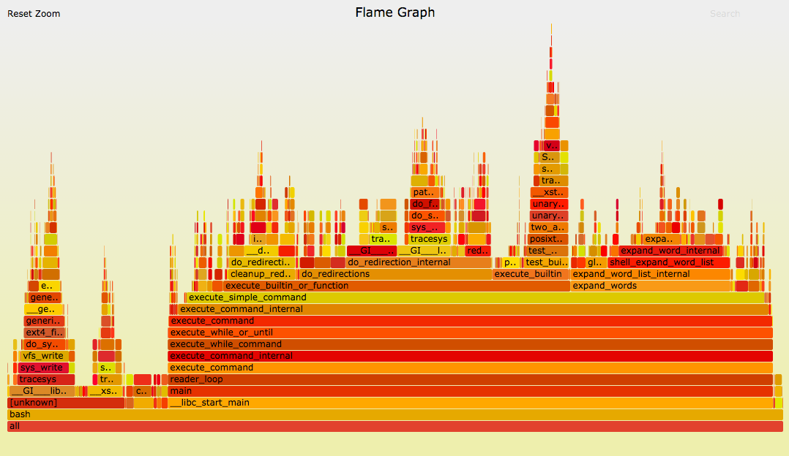

# Week 08

## Task 1

I profiled the `cargo-bp show` workflow in the `battery-pack` project and found that it launched a separate `rustfmt` process for each generated Rust file. For the tested template, this meant 11 formatter processes.

I changed the implementation to batch all Rust files into one `rustfmt` invocation. The mean runtime decreased from **216.78 ms to 82.43 ms**, a **61.97% reduction**. Flame graphs and process tracing confirmed that repeated `rustfmt` startup was the main bottleneck. The optimized output matched the original output byte-for-byte, I opened an [issue](https://github.com/battery-pack-rs/battery-pack/issues/184) to suggest my fix.

## Task 2

I am still looking...

## Task 3

I have read Brendan Gregg's flame graph examples from the [CPU Flame Graphs article](https://www.brendangregg.com/FlameGraphs/cpuflamegraphs.html) and watched his talk [USENIX ATC '17: Visualizing Performance with Flame Graphs](https://youtu.be/D53T1Ejig1Q).

Flame graphs visualize sampled stack traces. Each box represents a function, and its width shows how frequently that function appeared in the samples. Wider boxes therefore represent a larger share of the measured resource. The boxes are stacked to show the call hierarchy, with callers below and called functions above. Their left-to-right position does not represent execution order.


there are many examples inj the blog, i focused on the mysql, bash and kernel flame graphs.

the mysql flame graph shows that the majority of time is spent in the wide blocking stacks on the right which identify file-I/O paths that prevented MySQL threads from continuing. One important path originates from query optimization through `JOIN::optimize()`. This suggests that storage access during query processing contributes to latency rather than active CPU computation.

The Bash off-CPU graph shows a wide stack involving Bash and readline. This represents time spent waiting for keyboard input. A smaller stack shows Bash waiting for child processes to complete.
This graph demonstrates that a wide frame does not always indicate a performance problem. Waiting for user input is expected behavior in an interactive shell.

Finally, The Linux kernel CPU flame graph shows several wide networking-related paths, including TCP send and receive functions, socket operations, and memory-copy routines. These wide stacks indicate that most CPU time is spent processing network traffic and moving data between kernel and user space.

## Task 4

I used `gdb` frequently while learning and developing C programs. One memorable bug happened when I passed a string literal to a function that modified its input. The program crashed with a segmentation fault.

Using `gdb`, I set breakpoints, stepped through the function, and inspected the string pointer and the failing write. I discovered that the pointer referred to a string literal stored in read-only memory. Modifying it caused undefined behavior.

I fixed the bug by using a writable character array instead:

```c
char text[] = "hello";
```

This was an important moment in my understanding of C memory. It helped me distinguish between string literals and mutable character arrays, and showed me how a debugger can reveal the real cause of a crash without relying on print statements.
