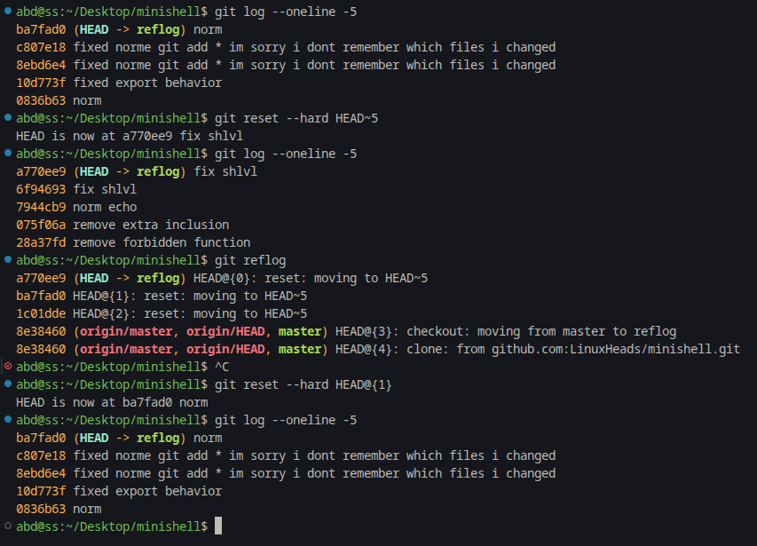

# Architecture Reflection

HEAD is a pointer to a reference, usually a branch under `.git/refs/heads/`, and a reference points to a commit. which points to a tree and stores metadata such as the author, committer, parent commit hashes, and commit message. trees represent a directory and contain references to blobs and other trees. Blobs store the actual contents of files without filenames or metadata. Walking through the commits made understand that git is fundementally a database of objects pointing to each other using hashes.

# Reflog Rescue Drill

# Refactor a commit history
I found multiple commits that I want to turn into conventional commits and I also added some commits with bad commit messages on top of them. Then I used `git rebase -i HEAD~5` to rebase the last 5 commits and change the commit messages to follow the conventional commit format. I also squashed commits together  to clean up the commit history. THe git log shows a much cleaner and more organized commit history that follows the conventional commit format, making it easier to understand the changes made in each commit. my previous were very low effort e.g., "fix bug" or "update code".